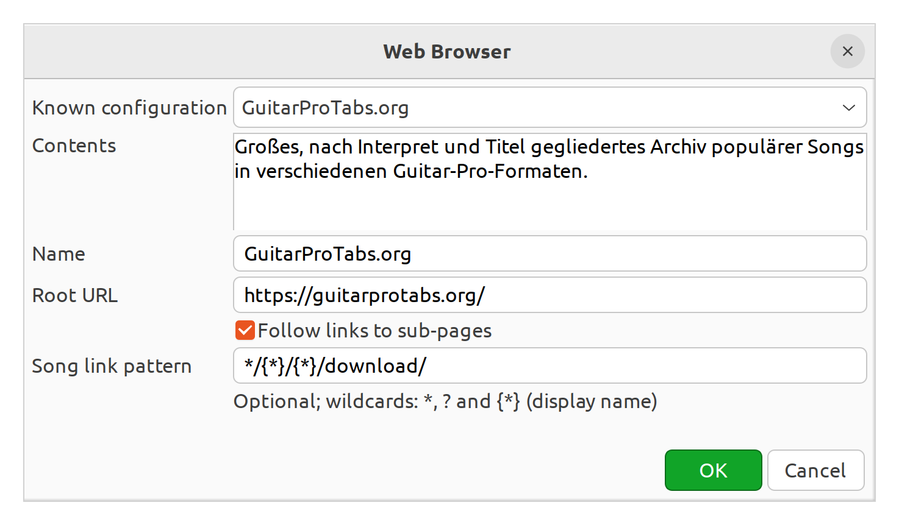
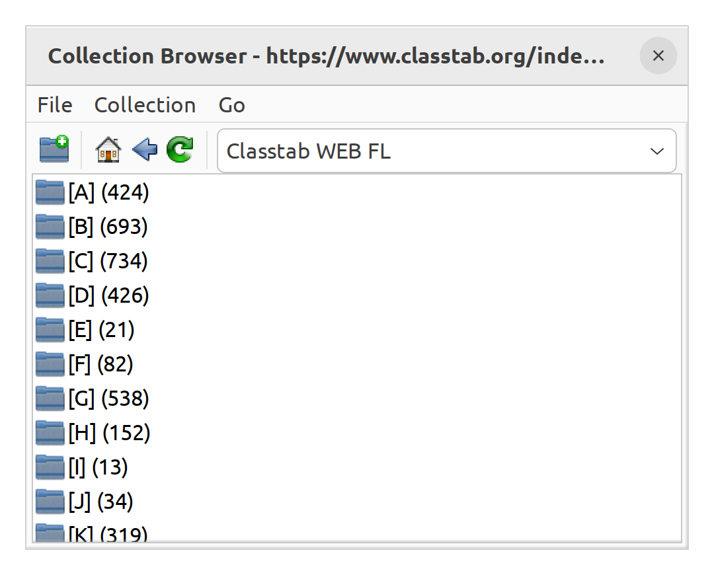
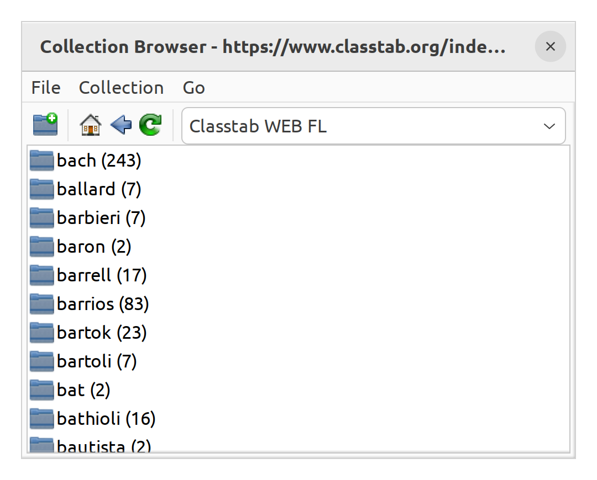

# TuxGuitar Web Browser

This plugin makes downloadable tablature and song files on a website available as a
collection in TuxGuitar. Give it a web address and it scans the page for formats that
TuxGuitar can open, such as Guitar Pro, Power Tab, TablEdit, and MIDI. The detected
files are organized into a navigable list and can be opened directly in TuxGuitar.

For sites whose files are spread across several pages, the plugin can also follow
links and build a simple folder-like navigation. Optional link patterns help identify
downloads on sites that do not expose a normal filename. Ready-made site presets are
loaded from an editable JSON file, so sources can be added or corrected without
recompiling the plugin.

## Screenshots

Choose a ready-made preset or enter the address and link rules for another site:

Detected files are grouped alphabetically to keep large collections manageable:

Where the source provides useful names, another level groups the files by composer,
artist, or filename prefix and shows the number of matching pieces:

## Way of working

The plugin turns the links found in HTML into a collection-like view. It does not
render the website, execute JavaScript, use the website's own menus, or crawl an
entire domain in the background. What appears in the collection therefore depends
on the links present in the HTML of the current page.

There are two kinds of archive:

### 1. Flat archives: virtual A-Z folders

A flat archive exposes its song files directly on one page. The plugin recognizes
links to formats supported by TuxGuitar and creates virtual A-Z folders from their
displayed names. `[A] (42)`, for example, means that 42 detected files begin with A.
These folders do not exist on the source website; they are generated by the plugin
to keep long lists manageable.

After opening a letter, files are listed directly. If at least two filenames share
the text before their first underscore, the plugin may add another virtual folder
for that prefix, which is often an artist or composer name. The browser's Back and
Home actions leave these virtual levels in the same way as normal folders.

When supported by the host TuxGuitar version, entering a search term returns matching
song files from the current page directly and bypasses the virtual A-Z and prefix
levels. Search does not scan linked sub-pages.

### 2. Website archives: page navigation plus A-Z

Some archives distribute their files over artist, composer, category, or detail
pages. For these presets, **Follow links to sub-pages** is enabled. The collection
then shows navigable same-site HTML links in addition to any A-Z folders created for
song files detected on the current page. Opening such an entry downloads and scans
that page, producing its own navigation and A-Z groups.

The plugin suppresses inherited site-wide navigation where possible so that repeated
headers and menus do not grow at every level. Same-host pages use `⌂`; links to other
hosts are collected separately under `Links extern` and use `↗`. Because this is
link-based navigation rather than a rendered browser, JavaScript-only controls and
downloads are not available.

Some websites use download URLs without a recognizable filename extension. A
configured `songPattern` marks those links as song entries and extracts useful parts
of the URL for the displayed artist and title. This changes link recognition only;
the resulting songs still use the same virtual A-Z organization.

## Features

- Detect Guitar Pro, Power Tab, TablEdit, MIDI, and other formats supported by TuxGuitar
- HTML downloads are limited to 5 MiB
- Scanning is limited to 10,000 links per page; partial results remain available
- Song files are opened using TuxGuitar's existing reader infrastructure
- Presets can be changed without recompiling the plugin

## Usage

1. Add a new **Web** collection in the TuxGuitar browser.
2. Enter a name and the root URL.
3. Optionally enable **Follow links to sub-pages**.
4. Optionally enter a **Song link pattern** to treat matching links as songs. The pattern supports `*` for any text and `?` for one character, for example `*/download/`.
5. Browse and open the detected song files.

## Presets

On first use, the bundled `web-browser-presets.json` is copied to TuxGuitar's user
`config/plugins` directory. Edit that copy to add, remove, or change presets without
recompiling or restarting TuxGuitar. Close and reopen the Web configuration dialog to
reload it. Every entry supports `name`, `description`, `url`, `followLinks`, and
`songPattern`.

The bundled presets are classified by the navigation model they use.

### Flat archives

- Les Gorven Jazz Standards
- Josef Huber Jazz MIDI
- bTd Big Band MIDI
- bTd Ragtime & Standards MIDI
- Guitar Jazz Tabs PTB
- Onefish Classical MIDI
- Tallstrom Fingerstyle GP5
- GPA Chet Atkins Fingerstyle TEF
- Duane Langston Fingerstyle TEF
- Steve McWilliam TEF & MIDI
- Martin Blake TEF
- Mandozine Mandolin TEF
- Banjr TEF & MIDI
- Strum Hollow TEF
- Dulcimertab TEF & MIDI

### Website archives

- MidKar Jazz MIDI
- Hotclub Powertab
- Jass and Chansons
- Classical Midi
- Classtab WEB FL
- Acoustic Fingerstyle
- AcousticPower
- Banjo Hangout
- BanjoBluegrass.fr TEF
- GuitarProTabs.org
- GProTab

## Status

Experimental implementation.  
Website structures vary, so not every site may work correctly.
